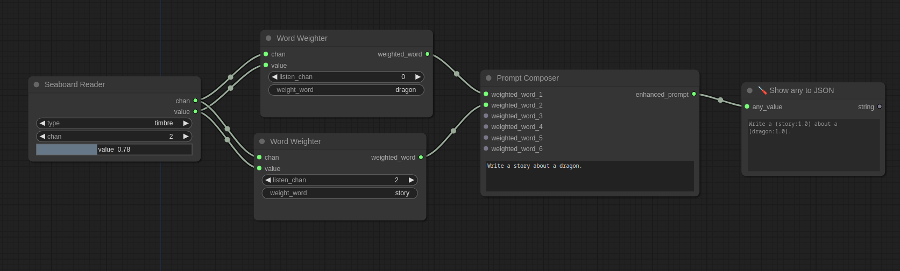

# enki's comfy nodes

This repository contains a set of custom nodes for the [ComfyUI](https://github.com/comfyanonymous/ComfyUI) project.

## Installation
To install the custom nodes, clone this repo into the `custom_nodes` folder of the ComfyUI project.

## Nodes

### Seaboard reader
This node reads the data from a Seaboard Block and outputs the pitch, pressure and strike values.

### Word Weight
This nodes weights the word in a prompt (comfyui style) based on seaboard input.

### Prompt Composer
Merge the weighted words into a prompt.

## Legal

This is not an official enki project, no support, no warranty, no nothing. Do whatever you want with it.
